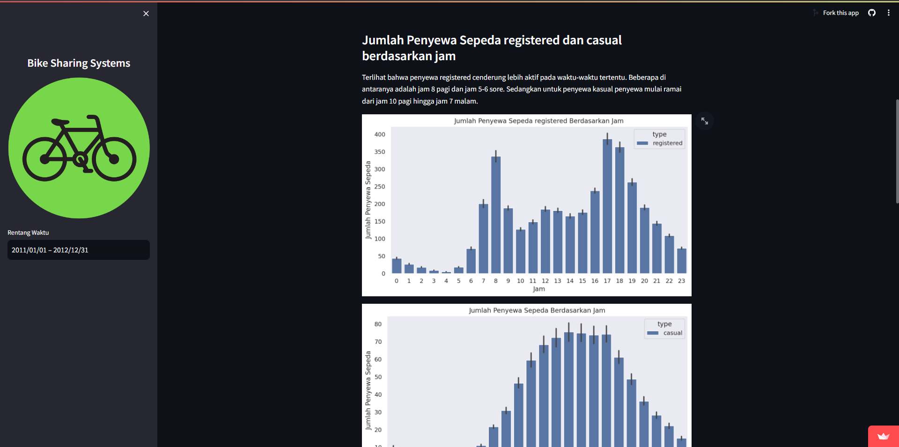
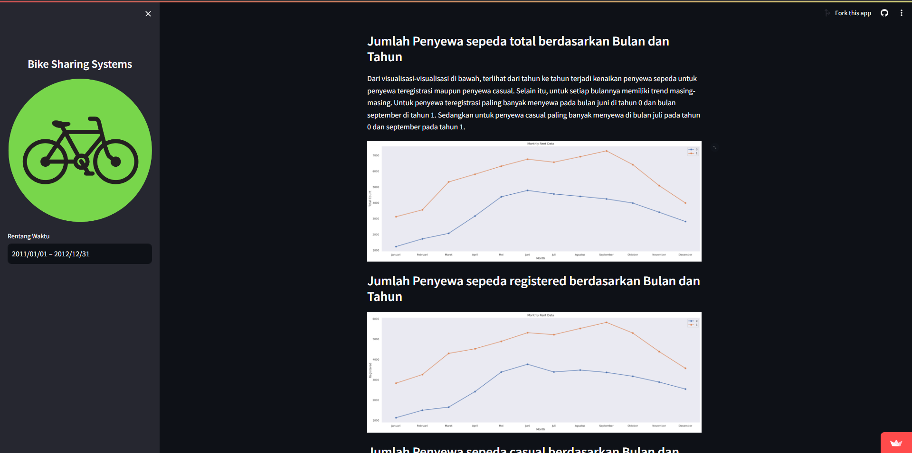
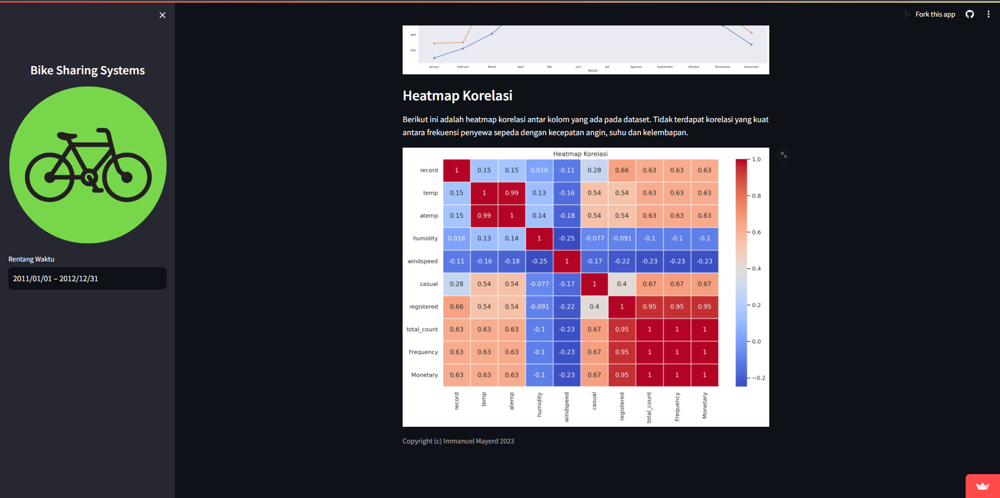

# Bike Sharing Systems

## Table of Contents
1. [Dashboard](#dashboard)
2. [Introduction](#introduction)
3. [Project Overview](#project-overview)
4. [Setup Environment](#setup-environment)
5. [Run Streamlit App](#run-streamlit-app)
6. [Directory Structure](#directory-structure)
7. [Screenshots](#screenshots)

## Dashboard
Access the interactive [dashboard](https://bss-dashboard.streamlit.app/) to explore the final results of this project.

## Introduction
Bike sharing systems are new generation of traditional bike rentals where whole process from membership, rental and return back has become automatic. Through these systems, user is able to easily rent a bike from a particular position and return back at another position. Currently, there are about over 500 bike-sharing programs around the world which is composed of over 500 thousands bicycles. Today, there exists great interest in these systems due to their important role in traffic, environmental and health issues. 

Apart from interesting real world applications of bike sharing systems, the characteristics of data being generated by these systems make them attractive for the research. Opposed to other transport services such as bus or subway, the duration of travel, departure and arrival position is explicitly recorded in these systems. This feature turns bike sharing system into a virtual sensor network that can be used for sensing mobility in the city. Hence, it is expected that most of important events in the city could be detected via monitoring these data.

In this project, I began by pinpointing the main business questions. I then proceeded with data wrangling, followed by exploratory data analysis (EDA), making visualizations, and conducting explanatory analysis. After analyzing the data, I came up with answers to the initial questions. I then created a dashboard using Streamlit and put it online on the same platform to display the findings clearly.

## Project Overview
- **Business Questions Identification**: Defined the core questions to guide the analysis.
- **Data Wrangling**: Organized and cleaned the data to prepare for analysis.
- **Exploratory Data Analysis (EDA)**: Investigated the data to uncover trends, anomalies, and patterns.
- **Visualization**: Created visual representations to showcase findings.
- **Explanatory Analysis**: Explored the data further to understand observed patterns and relationships.
- **Dashboard Creation**: Developed an interactive dashboard using Streamlit for an intuitive view of results.

## Setup Environment
To set up your environment, execute the following commands:
```
conda create --name main-ds
conda activate main-ds
pip install numpy pandas scipy matplotlib seaborn jupyter streamlit
```

## Run Streamlit App
Start the Streamlit app with the command below:
```
streamlit run dashboard/dashboard.py
```

## Directory Structure
- 📂 dashboard
  - 📄 dashboard.py
  - 📄 day.csv
  - 📄 hour.csv
- 📂 data
  - 📄 day.csv
  - 📄 hour.csv
- 📂 screenshots
  - 📄 1.png
  - 📄 2.png
  - 📄 3.png
  - 📄 4.png
- 📄 README.md
- 📓 notebook.ipynb
- 📄 requirements.txt

## Screenshots
|  |  |
|------------------------------------|------------------------------------|
|  |  |

